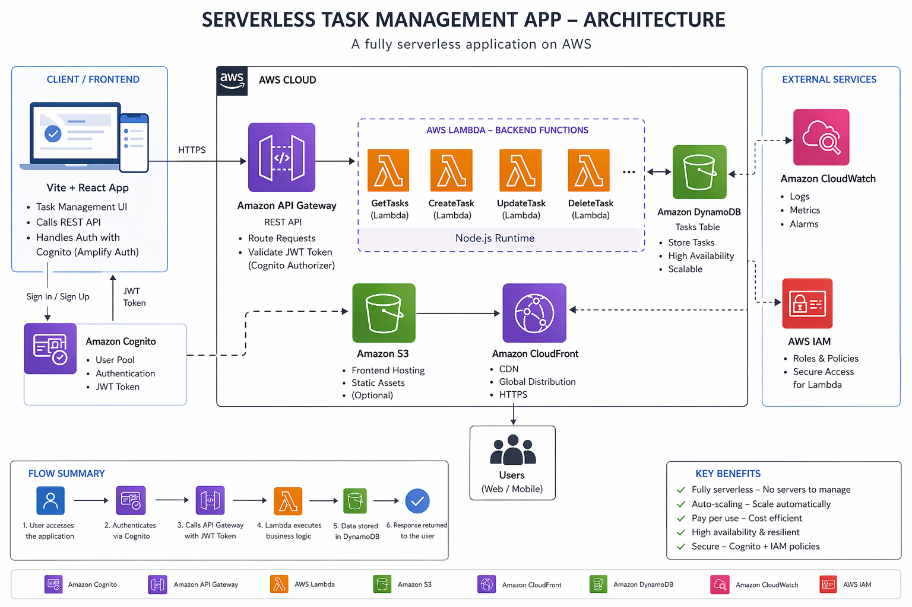
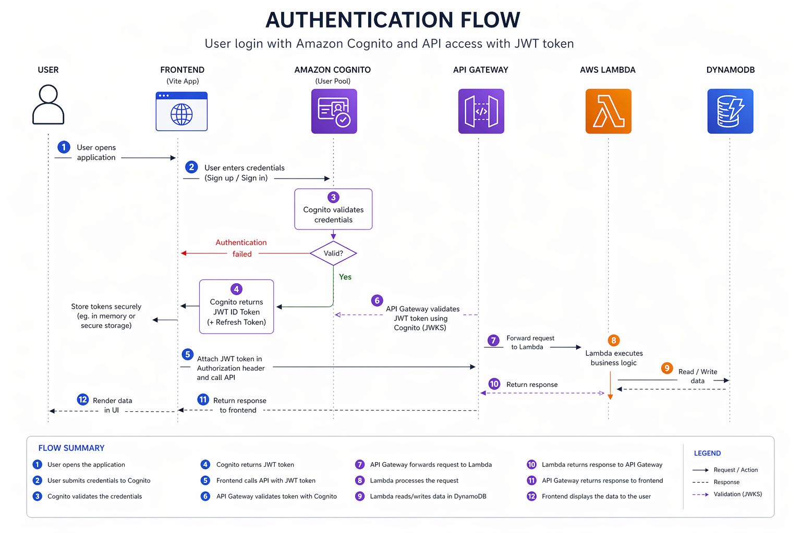
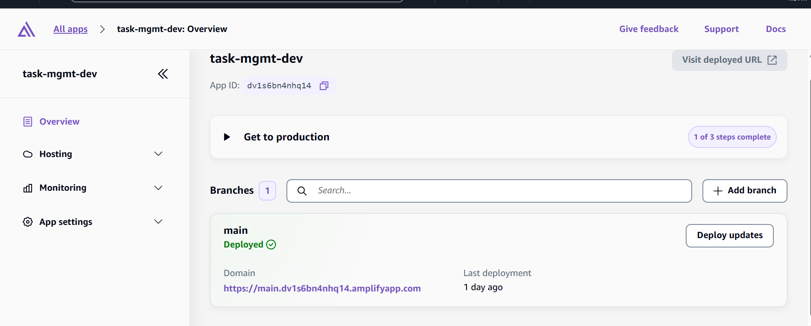
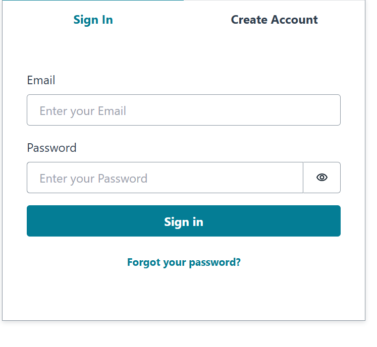
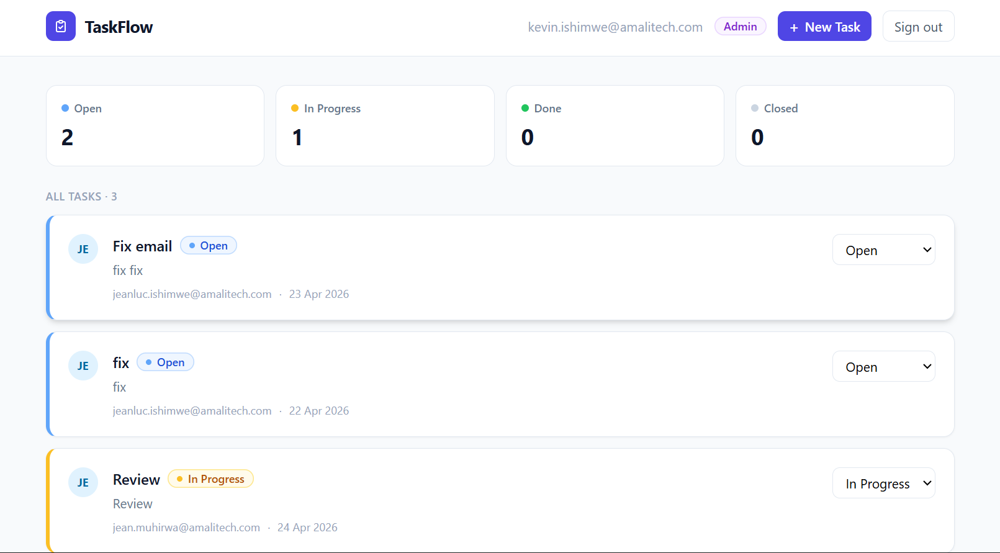
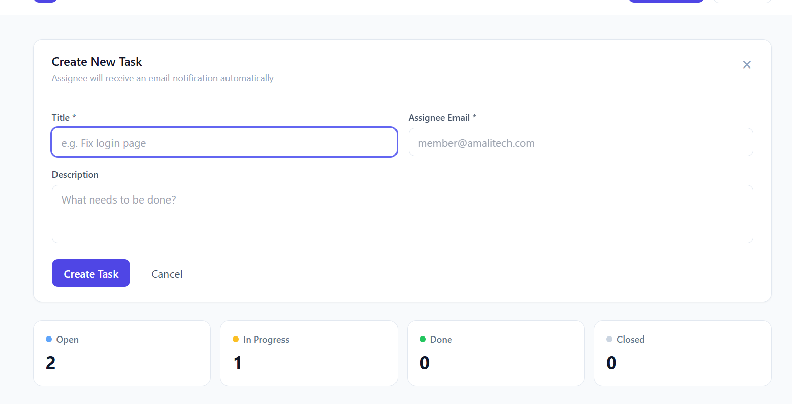

# Serverless Task Management App

A full-stack **serverless task management application** built on AWS. It demonstrates modern cloud architecture using Lambda-based backend functions, API Gateway, Cognito authentication, and Terraform for Infrastructure as Code.


#  Architecture Overview



This project follows a **serverless architecture**, where backend logic is implemented as code but executed on AWS managed services.

### System Flow

1. User accesses frontend (Vite app)
2. User authenticates via Cognito
3. Frontend calls API Gateway
4. API Gateway triggers Lambda functions
5. Lambda interacts with DynamoDB
6. Response is returned to frontend


# Tech Stack

## Frontend

* Vite (React-based build tool)
* AWS Cognito SDK (authentication handling)
* JavaScript / TypeScript

## Backend (Serverless Functions)

* AWS Lambda (Node.js functions)
* REST API handlers
* Business logic layer

## Cloud Services

* Amazon Cognito
* API Gateway
* AWS Lambda
* DynamoDB
* S3 (optional frontend hosting)

## Infrastructure

* Terraform (Infrastructure as Code)
* AWS Cloud

---

# AWS Services Used

* Amazon Cognito → Handles user authentication, JWT tokens, and session management
* Amazon API Gateway → Exposes backend endpoints securely
* AWS Lambda → Executes all backend functions
* Amazon DynamoDB → Stores tasks and application data
* Amazon S3 → Hosts static frontend build files
* Terraform → Manages all cloud infrastructure


#  Project Structure

```bash id="proj456"
serveless-taskManagementLab/
│
├── frontend/              
│   ├── dist/
│   └── .env
│
├── backend/                
│   ├ #Backend files
│
├── infra/                 
│   ├── main.tf
│   ├── variables.tf
│   └── modules/
│
└── README.md
```

# Authentication Flow



1. User logs in from frontend
2. Amazon Cognito validates credentials
3. JWT token is issued
4. Frontend attaches token to API requests
5. Amazon API Gateway validates token
6. AWS Lambda processes request


# Backend Architecture (Serverless Concept)

!!!Even though backend code exists locally, it runs entirely on AWS.

### Backend characteristics:

* Each file = one Lambda function
* No server management required
* Stateless execution
* Triggered via API Gateway events

### Example:

```bash id="backend789"
backend/
├── createTask.js   → Create task
├── getTasks.js     → Fetch tasks
├── updateTask.js   → Update task
├── deleteTask.js   → Delete task
```

# Deployment Flow



1. Terraform provisions AWS infrastructure
2. Frontend dependencies installed (`npm ci`)
3. Frontend built (`npm run build`)
4. Build artifacts packaged into ZIP
5. Deployment pushed to AWS environment


# Setup Instructions

## 1. Clone Repository

```bash id="clone2"
git clone https://github.com/serveless-taskManagementLab
cd serveless-taskManagementLab
```


## 2. Configure Environment Variables

```env id="env999"
VITE_API_ENDPOINT=https://your-api-id.execute-api.region.amazonaws.com
VITE_USER_POOL_ID=your-cognito-user-pool-id
VITE_USER_POOL_CLIENT_ID=your-client-id
```

## 3. Install Dependencies

```bash id="install2"
cd app
npm install
```

## 4. Run Frontend

```bash id="run2"
npm run dev
```

## 5. Build Frontend

```bash id="build2"
npm run build
```

## 6. Deploy Infrastructure

```bash id="tf2"
cd infra
terraform init
terraform apply
```

# Key Features

* Secure authentication via Cognito
* Fully serverless backend (Lambda)
* REST API via API Gateway
* Scalable NoSQL storage (DynamoDB)
* Infrastructure as Code (Terraform)
* Automated deployment pipeline
* Production-ready cloud architecture

# 📸 Screenshots

## Login Page



## Dashboard



## Task Management



# Author

Kevin Ishimwe